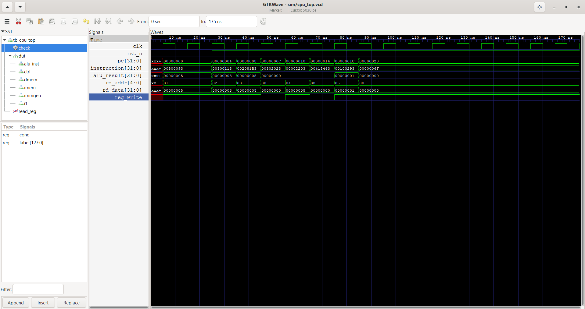

# Single-Cycle RISC-V CPU — Verilog HDL

A fully functional single-cycle RISC-V processor implementing the RV32I base integer instruction set, built from scratch in Verilog HDL. Designed, simulated, and verified as part of a VLSI/RTL design portfolio.

## Supported Instructions

| Type | Instructions |
|---|---|
| R-type | `add` `sub` `and` `or` `xor` `slt` `sll` `srl` |
| I-type | `addi` `andi` `ori` `xori` `slti` |
| Load | `lw` |
| Store | `sw` |
| Branch | `beq` |
| Jump | `jal` |

## Datapath

```
         ┌─────────────────────────────────────────────────────────┐
         │                    cpu_top                              │
         │                                                         │
         │  ┌──────┐   ┌───────────┐   ┌──────────┐              │
  clk ───┤  │  PC  ├──▶│ instr_mem ├──▶│  Decode  │              │
         │  └──────┘   └───────────┘   └────┬─────┘              │
         │      ▲                           │opcode/funct          │
         │      │                           ▼                      │
         │      │                    ┌──────────────┐             │
         │      │                    │ control_unit │             │
         │      │                    └──────┬───────┘             │
         │      │                           │ control signals      │
         │      │       ┌───────────┐       │                      │
         │      │  ┌───▶│  regfile  │◀──────┘                     │
         │      │  │    └─────┬─────┘                             │
         │      │  │          │ rs1, rs2                           │
         │      │  │          ▼                                    │
         │      │  │    ┌──────────┐   ┌───────────┐             │
         │      │  │    │   ALU    ├──▶│ data_mem  │             │
         │      │  │    └────┬─────┘   └─────┬─────┘             │
         │      │  │         │               │                     │
         │      │  └─────────┴───────────────┘                    │
         │      │            │ write-back                          │
         │      │    ┌───────┘                                     │
         │      └────┤ PC+4 / branch / jump                        │
         └───────────┴─────────────────────────────────────────────┘
```

## Module Breakdown

| Module | Description | Key Design Points |
|---|---|---|
| `alu.v` | 32-bit ALU, 8 operations | `$signed()` cast for SLT |
| `regfile.v` | 32×32-bit register file | x0 hardwired to zero, 2 read ports |
| `imm_gen.v` | Immediate generator | I/S/B/J formats, sign extension |
| `control_unit.v` | Instruction decoder | Generates all control signals |
| `instr_mem.v` | Instruction ROM | Loaded from `.hex` file |
| `data_mem.v` | Data RAM | Sync write, async read |
| `cpu_top.v` | Top-level datapath | Connects all modules |

## How It Works

Every clock cycle, the CPU completes the full fetch-decode-execute cycle:

1. **Fetch** — PC selects instruction from instruction memory
2. **Decode** — instruction fields (opcode, rs1, rs2, rd, funct3, funct7) extracted
3. **Control** — control unit generates alu_ctrl, reg_write, mem_write, branch, jump signals
4. **Read** — register file reads rs1 and rs2 combinationally
5. **Execute** — ALU computes result or memory address
6. **Memory** — data memory read (lw) or write (sw) if needed
7. **Write-back** — result written to rd in register file
8. **PC update** — PC+4, branch target, or jump target

## Test Program

The CPU is verified by running a hand-assembled RISC-V program that exercises every instruction type:

```asm
addi x1, x0, 5      # x1 = 5
addi x2, x0, 3      # x2 = 3
add  x3, x1, x2     # x3 = 8  (R-type arithmetic)
sw   x3, 0(x0)      # mem[0] = 8  (store to memory)
lw   x4, 0(x0)      # x4 = 8  (load from memory)
beq  x3, x4, +8     # branch taken (x3 == x4)  → skip next
addi x5, x0, 0      # SKIPPED (branch proof)
addi x5, x0, 1      # x5 = 1  (confirms branch worked)
jal  x0, 0          # infinite loop (halt)
```

Expected register state after execution:

| Register | Expected | Meaning |
|---|---|---|
| x1 | 5 | addi result |
| x2 | 3 | addi result |
| x3 | 8 | add result |
| x4 | 8 | loaded from memory |
| x5 | 1 | branch taken, skip proved |
| x0 | 0 | hardwired zero, never changes |

## File Structure

```
riscv_cpu/
├── rtl/
│   ├── alu.v            — 32-bit ALU
│   ├── regfile.v        — 32×32-bit register file
│   ├── imm_gen.v        — immediate generator (I/S/B/J formats)
│   ├── control_unit.v   — instruction decoder
│   ├── instr_mem.v      — instruction ROM
│   ├── data_mem.v       — data RAM
│   └── cpu_top.v        — top-level datapath
├── tb/
│   ├── tb_alu.v         — ALU testbench (15 tests)
│   ├── tb_regfile.v     — register file testbench (9 tests)
│   ├── tb_imm_gen.v     — immediate generator testbench (9 tests)
│   ├── tb_control_unit.v— control unit testbench (43 tests)
│   ├── tb_memory.v      — memory testbench (7 tests)
│   └── tb_cpu_top.v     — full CPU testbench (8 tests)
├── programs/
│   └── program.hex      — hand-assembled RISC-V test program
├── docs/
│   └── waveform_cpu.png — GTKWave execution trace
└── sim/                 — VCD waveform output
```

## Simulation

Tested with Icarus Verilog 12.0 and GTKWave on Windows.

**Simulate individual modules:**
```
iverilog -g2012 -o sim/alu.out rtl/alu.v tb/tb_alu.v
vvp sim/alu.out

iverilog -g2012 -o sim/regfile.out rtl/regfile.v tb/tb_regfile.v
vvp sim/regfile.out

iverilog -g2012 -o sim/control_unit.out rtl/control_unit.v tb/tb_control_unit.v
vvp sim/control_unit.out
```

**Simulate full CPU:**
```
iverilog -g2012 -o sim/cpu_top.out rtl/alu.v rtl/regfile.v rtl/imm_gen.v rtl/control_unit.v rtl/instr_mem.v rtl/data_mem.v rtl/cpu_top.v tb/tb_cpu_top.v
vvp sim/cpu_top.out
```

**View waveforms:**
```
gtkwave sim\cpu_top.vcd
```

## Test Results

| Module | Tests | Result |
|---|---|---|
| ALU | 15 | ✅ All passing |
| Register file | 9 | ✅ All passing |
| Immediate generator | 9 | ✅ All passing |
| Control unit | 43 | ✅ All passing |
| Memory | 7 | ✅ All passing |
| Full CPU (end-to-end) | 8 | ✅ All passing |
| **Total** | **91** | **✅ 91/91** |

## Waveform



*GTKWave output showing PC incrementing through instructions, register values updating, and branch/jump PC transitions.*

## Design Decisions

**Why single-cycle?** Single-cycle is the cleanest starting point — one instruction completes fully every clock cycle. The datapath logic is straightforward and debuggable. A pipelined version (5-stage with forwarding and hazard detection) is the natural next step.

**Why RV32I subset?** The full RV32I has 47 instructions. The 14 implemented here cover every instruction *type* (R, I, S, B, J) and are enough to run real programs with arithmetic, memory access, branches, and loops. Adding more instructions is purely additive — the datapath doesn't change.

**Why x0 is protected twice** — once in the write logic and once in the read logic. Even if the write protection had a bug, reads of x0 would still return 0. Critical invariants deserve redundant protection.

**Why `$signed()` in SLT** — without it, Verilog treats both operands as unsigned. `-5 < 3` would evaluate incorrectly since -5 as unsigned is a large positive number. RISC-V's `slt` is a signed comparison, making this cast functionally critical.

## Resume Bullet

> Designed and verified a single-cycle RISC-V CPU (RV32I subset) in Verilog HDL — implemented ALU, 32×32-bit register file, immediate generator, instruction decoder, and full datapath; verified end-to-end execution of arithmetic, memory, branch, and jump instructions with 91 directed test cases using Icarus Verilog and GTKWave.

## Target Hardware

Designed for **Sipeed Tang Nano 9K** (Gowin GW1NR-9). Constraint file (`.cst`) to be added when board is available. All RTL is standard Verilog — portable to any FPGA toolchain.

## Author

Janvi Papola 
https://github.com/Janvi-00624